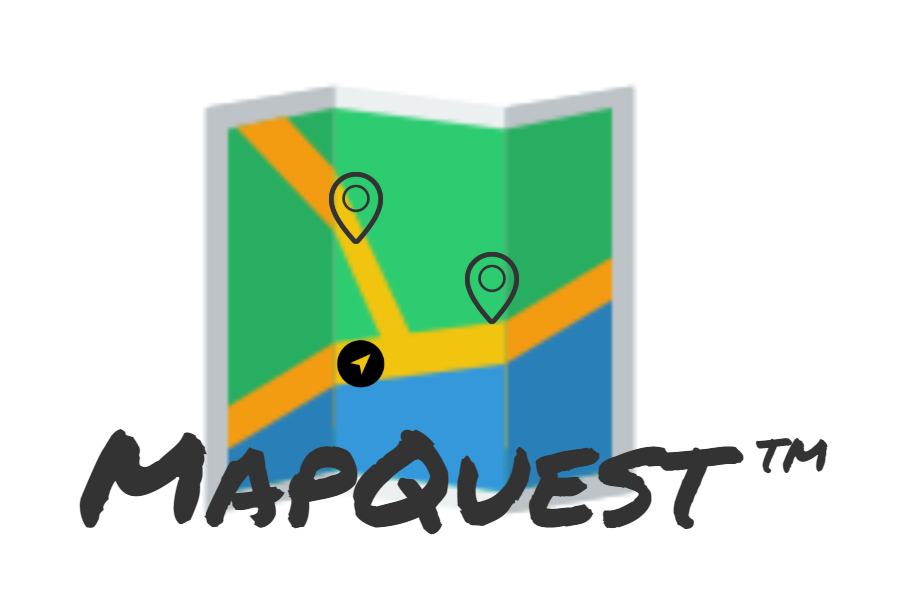

##MapQuest
A Google Maps oriented game with funny stories and missions to perform.

This is the frontend made in React.js 


To run you need to add a .env file in the root folder containing Google API Key. Google API calls must be done over https.


.env
```
HTTPS=true
REACT_APP_GOOGLE_API_KEY='xxxxxxxxxxxxxxx';
```

Backend in Spring Boot can be found here: https://github.com/Tankesmedjan/mapquest-backend.git